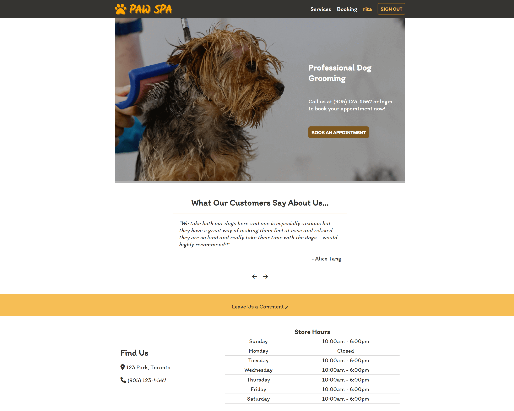
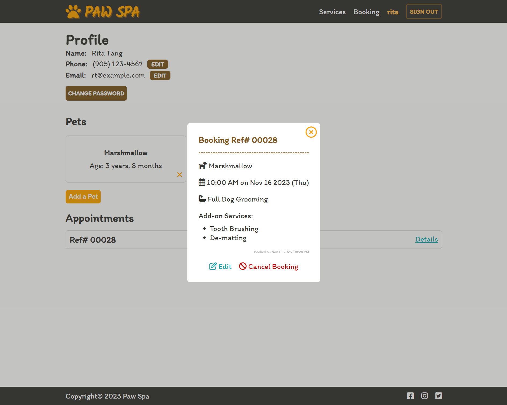
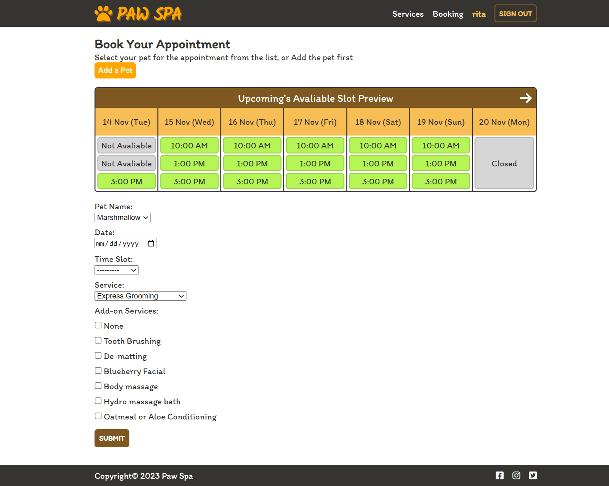

# PAW SPA
This web application is created as the capstone project for CS50W. It is a booking application for dog owners to book pet grooming services for their dogs. I got the inspiration for the project due to my experience of having to call the store to book such an appointment every time. Although I am aware that this is not a brand-new idea, I believe, in this technologically advanced era, customers should be provided with an online system where they can easily book an appointment and choose the services they want.

## Screenshots

Homepage

Profile page

Booking page

## Table of contents

- [Distinctiveness and Complexity](#distinctiveness-and-complexity)
- [Specifications and What to Expect](#specifications-and-what-to-expect)
  - [/templates folder](#templates-folder)
  - [/static folder](#static-folder)
  - [models.py](#modelspy)
  - [forms.py](#formspy)
  - [utilities.py](#utilitiespy)
- [How to run the application](#how-to-run-the-application)
- [Screencast](#screencast)

## Distinctiveness and Complexity

- There are 4 models in this application in addition to the User model, among which the Owner model is an extension of the User model, it has a one-to-one relationship to the User model.
- Users can change their password through the profile page.
- Make use of the messages framework to display flash messages instead of rendering the message as context to display in the template.
- Some checking logic has been added to modelForm in forms.py to ensure the validity of the data input, a validation error will be raised in case of any validation failure.
- Since this is a booking web application, there are many instances where comparisons and calculations of date and time are necessary, and to make this possible between two programming languages, either their format has to be consistent, or converting from a date string into a date object, or vice versa, is required.
- A dynamic preview schedule of time slots for the five weeks ahead starting from today is available for customers to get a grasp of the currently available time slots for booking. Furthermore, when each of the available time slots is clicked, the date and time field of the appointment booking form located on the same page should be populated accordingly. To accomplish these results, coordination between HTML, Javascript and Django is crucial.
- Many of the updates to the database can be done on the profile page, including personal information, pets and booked appointments. In particular, the editing and cancelling of an appointment are done within a modal on the profile page. It is more complex to populate the modelForm with data from Django through Javascript than to render a pre-filled form through a Django template while the form input fields are not purely in text type.

## Specifications and What to Expect

### `/templates` folder

- Layout
  - Same as previous projects, this template provides the basic HTML layout that would appear on every page, i.e. the head of an HTML document, the navigation bar, as well as the toggle menu on small screen and its JS file, and the footer
- Index
  - For users not logged in, they are able to view the reviews written by other users in the form of a slider. Ten, or all if there are fewer, approved reviews are randomly in random order from the database. Though the review shown in the slider would change periodically, users can also go through the reviews themselves by utilizing the previous and next arrows right below the slider.
  - For logged-in users, they can leave comments in the textarea which can be toggled open and close by the text below the review slider section.
  - Comments have to be approved by staff before they can be drawn to show in the review section.
- Services
  - This is a static page, it lists out the services and corresponding prices offered for different sizes of dogs.
  - Credits to [GUAU](https://www.guau.ca/dog-grooming-services/) for the prices and services information of dog grooming.
- Register
  - On top of the usual fields to register for an account in previous projects, phone number is also included in this register form, but it is not mandatory.
- Login
  - This is the page where customers log in to their accounts.
  - If a customer accesses the login page through the login button, he/ she will be directed to the profile page after successful login.
  - If a customer is directed to the login page through the book appointment button, he/ she will be redirected to the booking page after successful login.
- Profile
  - Users are required to log in to view this page.
  - In the personal information section, customers have the option to edit or update their email or phone number on the profile page. Customers can also change their password through the profile page.
  - In the pet section, customers can add or delete pets under the current user account, which information is for booking a pet grooming appointment.
  - In the booking section, customers can view the upcoming appointments that have been booked in chronological order, details will be shown in a modal. From here, Customers are able to cancel the appointment or edit the date, time, dog, as well as services of an existing appointment given that the newly selected time slot is available. When editing an existing appointment, the form will be pre-populated with the appointment record from the database.
- Change Password
  - Users can change their password here, with the basic constraints that the existing password is input correctly, the existing password cannot be the same as the new password, and the new password must be at least 6 characters in length.
  - Once the password is updated successfully, the user will be directed to the login page and instructed to log in with the new password.
- Booking
  - Users are required to log in to view this page.
  - If users are logged in through the prompt by clicking on the "Book" button on the index or service page, they will be redirected back to this booking page once the login process is completed.
  - Users are able to add the pet for whom the appointment they would like to book before booking the appointment.
  - A dynamic preview schedule of time slots for the coming week (up to five weeks) is available at the top of the booking form. The first displayed date is always the current date. There are 3 types of slots:
    1. **Closed** - They are in grey background. As the store is closed on Monday, all Mondays will have a div element with the text "Closed".
    2. **Not Available** - They are in grey background. A slot is unavailable either because someone has already booked an appointment at that time slot or the current time has passed the slot starting time.
    3. **Available** - They are in green background, showing the corresponding time for the time slot, and are attached onClick event listener. When each of the available time slots is clicked, the date and time field of the appointment booking form located on the same page should be populated accordingly.

### `/static` folder

In the application's static folder, there is the favicon for the website, CSS stylesheet, and javascript files. Script.js is the common JS file for all the webpages to enable the menu toggle and close functionality in small screen sizes, while the others are for each of the webpages with a fair amount of Javascript code, named after their HTML template counterparts.

### `models.py`

As mentioned above, there are 4 models in addition to the User model.

1. Owner - This model is an extension of the User model, it has a one-to-one relationship to the User model, and its main function is to store the phone number of each user.
2. Pet - This model stores the pet-related information and an owner as its foreign key.
3. Appointment - This model stores the appointment information, each date and time pair should be unique, so there cannot be two appointments with the same date and time pair. It takes Owner and Pet as foreign keys. The remarks field is for staff to input additional information about an appointment as deemed necessary, e.g. to input the customer contact information when a customer booked through a call.
4. Comments - This model stores the reviews written by customers, it contains an **Approved** boolean field which is set to `False` by default. Once a staff member has approved a review, it would have a chance to be drawn from the database to display in the review slider on the homepage.

### `forms.py`

There are the two most important model form of the application which are based on two of the models, Pet and Appointment.

#### PetForm

- The main checking on the PetForm is to ensure the date of birth of the pet cannot be a date in the future.

#### AppointmentForm

- The AppointmentForm checks the validity of the date and time. It ensures an appointment cannot be in the past, not on a Monday, not more than five weeks ahead, and not taken by other users. If the error is due to the selected time slot being already taken by another user, a message containing the available time slots on the selected date will be shown.
- The Django package, [multiselectfield](https://pypi.org/project/django-multiselectfield/), is utilized for add-on service checkboxes, on the other hand, Javascript is used on the front-end to avoid customers being able to choose "None" together with other add-on services at the same time

### `utilities.py`

Here are three tools that are being used across the web application. Their usage is as follows:

1. For checking the available time slot when the booking form is submitted on the booking page. It is used in `forms.py`.
2. Convert the format between date and string in the URL. It is used in `urls.py`.
3. Return a dictionary of available and unavailable time slots, which will be sent to Javascript to render the preview schedule. It is used in `views.py`.

## How to run the application

1. As a normal customer who visits this application for the first time, he/she can view the reviews and prices of services while not having an account.
2. If a customer would like to book an appointment, he/she can either give a call to the store and a staff member will mark the appointment for the customer, or he/she can register for an account to book an appointment online.
3. The customer can either go to the profile page to add a pet first or go directly to the booking page to add the pet there.
4. Once a pet is added, the customer will then be able to select the pet from the dropdown in the booking form to book an appointment for that pet.
5. After an appointment is booked successfully, the customer will be redirected to their profile page, from where he/she can view, edit, or cancel the appointment.
6. Customers can also choose to delete an added pet under the current account, all the related data and any booked appointments for the pet will be deleted as well. A prompt will be shown to warn the customer in case he/ she pressed the cross (i.e. delete button) on the pet div element
7. Staff can then check through the Django admin for who has made appointments and for what time slot.

## Screencast

Click [here](https://youtu.be/spwQXbifY2E) to watch it in action
